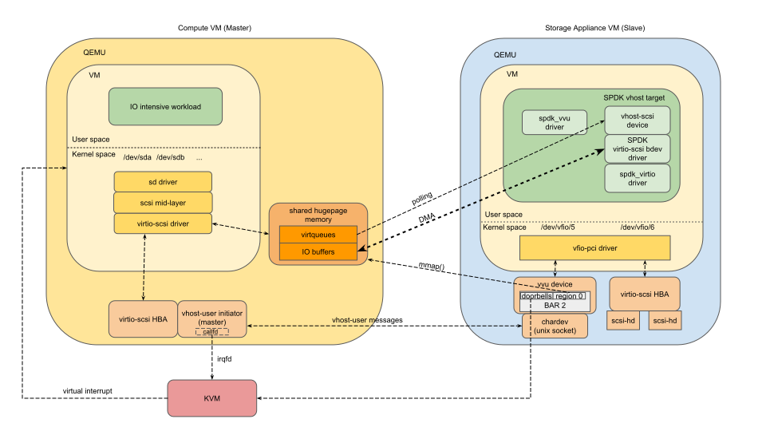

# SPDK vhost target with vvu support

## Overview

This is an extension of the vhost-user transport mechanism that enables
deploying the SPDK vhost target into a dedicated Storage Appliance VM
instead of host user space.

The code is here:
[https://github.com/ndragazis/spdk](https://github.com/ndragazis/spdk)

## Topology



There is a Storage Appliance VM that offers emulated storage devices to
a Compute VM.

## Benefits

There are two benefits over the existing solution:
* in a cloud environment security really matters. So, running the SPDK
  vhost target inside a VM instead of host user space is definitely
  better in terms of security.
* this will enable the users in the cloud to create their own storage
  devices for their compute VMs. The user gains control of his storage. You
  can have full control of what your application will be seeing as storage
  devices. This was not possible with the previous topology because running the
  SPDK vhost target on host user space could only be done by the cloud provider.
  So, with this topology, users can create their own custom storage devices
  because they can run themselves the SPDK vhost app.

## How does it work

Moving the vhost target from host user space to a VM creates three
issues with the vhost-user transport mechanism that need to be solved.
1. We need a way so that the vhost-user messages can reach the SPDK
   vhost target.
2. We need a mechanism so that the SPDK vhost target can have access to
   the Compute VM’s file backed memory.
3. We need a way for the SPDK vhost target to interrupt the compute VM.

These are all solved by a special virtio device called
“*virtio-vhost-user*”. This device was created by Stefan Hajnoczi and is
described here:
[https://wiki.qemu.org/Features/VirtioVhostUser](https://wiki.qemu.org/Features/VirtioVhostUser)

This device solves the above problems as follows:
1. it reads the messages from the unix socket and passes them into a
   virtqueue. A user space driver in SPDK receives the messages from the
   virtqueue. The received messages are then passed to the SPDK
   vhost-user message handler.
2. it maps the vhost memory regions sent by the master with message
   `VHOST_USER_SET_MEM_TABLE`. The vvu device exposes those regions to the
   guest as a PCI memory region.
3. it intercepts the `VHOST_USER_SET_VRING_CALL` messages and saves the
   callfds for the virtqueues. For each virtqueue, it exposes a doorbell
   to the guest. When this doorbell is kicked from the SPDK vvu driver,
   the device kicks the corresponding callfd.

## Step-by-step Guide

SPDK version: [https://github.com/ndragazis/spdk](https://github.com/ndragazis/spdk)\
QEMU version: [https://github.com/stefanha/qemu/tree/virtio-vhost-user](https://github.com/stefanha/qemu/tree/virtio-vhost-user)

1. Compile QEMU and SPDK:
```
$ git clone -b virtio-vhost-user https://github.com/stefanha/qemu
$ (cd qemu && ./configure --target-list=x86_64-softmmu && make)
```
```
$ git clone https://github.com/ndragazis/spdk.git
$ cd spdk
$ git submodule update --init
$ ./configure
$ make
```

2. Launch the Storage Appliance VM:
```
$ ./qemu/x86_64-softmmu/qemu-system-x86_64 \
  -machine q35,accel=kvm -cpu host -smp 2 -m 4G \
  -drive if=none,file=image.qcow2,format=qcow2,id=bootdisk \
  -device virtio-blk-pci,drive=bootdisk,id=virtio-disk1,bootindex=0,addr=04.0 \
  -device virtio-scsi-pci,id=scsi0,addr=05.0 \
  -drive file=scsi_disk.qcow2,if=none,format=qcow2,id=scsi_disk \
  -device scsi-hd,drive=scsi_disk,bus=scsi0.0,channel=0,scsi-id=0,lun=0 \
  -drive file=nvme_disk.qcow2,if=none,format=qcow2,id=nvme_disk \
  -device nvme,drive=nvme_disk,serial=1,addr=06.0 \
  -chardev socket,id=chardev0,path=vhost-user.sock,server,nowait \
  -device virtio-vhost-user-pci,chardev=chardev0,addr=07.0
```

The SPDK code needs to be accessible to the guest in the Storage
Appliance VM. A simple solution would be mounting the corresponding host
directory with sshfs, but it’s up to you.

3. Create the SPDK vhost SCSI target inside the Storage Appliance VM:
```
$ sudo modprobe vfio enable_unsafe_noiommu_mode=1
$ sudo modprobe vfio-pci
$ cd spdk
$ sudo scripts/setup.sh
$ sudo app/vhost/vhost -S "0000:00:07.0" -T "vvu" -m 0x3 &
$ sudo scripts/rpc.py construct_vhost_scsi_controller --cpumask 0x1 vhost.0
$ sudo scripts/rpc.py construct_virtio_pci_scsi_bdev 0000:00:05.0 VirtioScsi0
$ sudo scripts/rpc.py construct_nvme_bdev -b NVMe1 -t PCIe -a 0000:00:06.0
$ sudo scripts/rpc.py construct_malloc_bdev 64 512 -b Malloc0
$ sudo scripts/rpc.py add_vhost_scsi_lun vhost.0 0 VirtioScsi0t0
$ sudo scripts/rpc.py add_vhost_scsi_lun vhost.0 1 NVMe1n1
$ sudo scripts/rpc.py add_vhost_scsi_lun vhost.0 2 Malloc0
```

4. Launch the Compute VM:
```
$ ./qemu/x86_64-softmmu/qemu-system-x86_64 \
  -M accel=kvm -cpu host -m 1G \
  -object
memory-backend-file,id=mem0,mem-path=/dev/shm/ivshmem,size=1G,share=on \
  -numa node,memdev=mem0 \
  -drive if=virtio,file=image.qcow2,format=qcow2 \
  -chardev socket,id=chardev0,path=vhost-user.sock \
  -device vhost-user-scsi-pci,chardev=chardev0
```

5. Ensure that the virtio-scsi HBA and the associated SCSI targets are
visible in the Compute VM:
```
$ lsscsi
```
